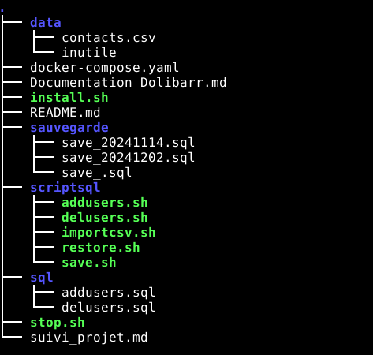

# Synthèse SAE-Dolibarr
#### DJENADI Arno & KERMARREC Gaëtan

### Objectif final

— L’installation sera automatisée, via le lancement d’un unique script *install.sh* qui va à la fois installer Dolibarr mais aussi le SGBD nécessaire.
— L’import des données exportées depuis l’ancien système sera automatisé via un unique script import *csv.sh*
— Afin de s’affranchir de l’OS sous-jacent du serveur, toute l’installation (Dolibarr + SGBD) sera de préférence ”dockerisée”.
— L’aspect sauvegarde est crucial. On veut pouvoir à un instant *t* faire une sauvegarde de toutes les données, et être capable, via la procédure d’installation ci-dessus, de repartir de 0 et tout récupérer (contexte d’un ”PRA” 3 après incident)

### Démarche réalisé
Nous avons choisi de mettre en place 3 docker distinct :
- Un avec dolibarr
- Un avec notre base de donnée MariaDb
- Et un dernier avec adminer
Le choix de rajouter un docker en plus de ce qui était demandé vient du fait que l'ajout d'adminer est un plus et que l'application / le docker permets d'avoir une vision plus simpliste sur la base de donnée et de voir les changements fait dessus simplement.(Ressemblant à PHPmyAdmin car il s'agit d'une ancienne version.) Lien vers l'image docker : https://hub.docker.com/_/adminer/

De plus nous avons choisis d'importer des données via non pas un fichier CSV mais un suite de commande SQL, nous avons trouvé la solution en cherchant sur internet et nous nous sommes dis que la solution pouvait être intéréssante à utiliser et nous démarquer des autres projets.

Nous avons fais en sorte que les dossiers et fichiers pour le projets soient logique, c'est à dire que juste en lisant les noms on puisse avoir une idée de comment ça marche et comment faire tel ou tel chose.

### Mise en place 

Dans cette partie nous allons vous expliquer comment faire pour lancer et mettre en place grâce à notre travail une infrastructure "dockerisée" contenant dolibarr, une base de donnée et adminer un visualiseur de base de donnée : 

Tout d'abord, il faut soit cloner ce dépot Git soit le télécharger en .zip et l'unzip ou vous le voulez (de préférence dans votre home linux si vous ne voulez pas changer les chemins). Attention, le dossier doit bien se nommer sae-dolibarr !
Après avoir fait ça vous devriez avoir une arborescence tel que celle-ci :

Une fois cela fait allez dans le dossier sae-dolibarr, puis pour lancer le tout il suffit de lancer le script install.sh, n'oubliez pas de vous donner les droits d'exécution sur le script :
`chmod +x install.sh`

Une fois que les conteneurs sont lancés vous pouvez accèder à dolibarr via localhost/9000 (mettre screen + accès) et à adminer via localhost/8080 (mettre screen + accès).

Pour ajouter des utilisateurs, allez dans le dossier scriptsql, `cd scriptsql/` puis attribuer vous les droits sur tout les scripts pour plus de practicité, `chmod +x *.sh` et enfin lancez le script pour l'ajout des utilisateurs `.\addusers.sh`

Pour supprimer des utilisateurs, encore dans le dossier scriptsql, lancez le script pour la suppression des utilisateurs `.\delusers.sh`.

Et enfin pour sauvegarder les modifications faite, toujours dans le dossier scriptsql, lancez le script pour la suppression des utilisateurs `.\save.sh` (non fonctionnel)

Avec tout cela vous avez les clés en main pour pouvoir utiliser notre solution à votre guise et l'améliorer comme bon vous semble.

### Problèmes rencontrés
- Nous rencontrons une erreur de type "Access Denied" lorsque nous essayons de sauvegarder, et ce problème persiste malgré nos tentatives de résolution. Cela indique que le système empêche l'accès au dossier ou au fichier où nous souhaitons enregistrer. Le problème est toujours présent sur la version actuel.
